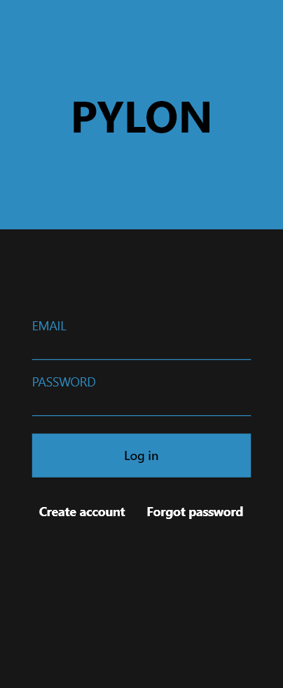

# Pylon
Pylon is a centralized, end-to-end encrypted chat application built using Go and Flutter.
It uses a hybrid cryptosystem to encrypt all user interactions with the server, as well as end-to-end encrypting messages.

The app is still in early development, the features implemented so far are: 
* Authentification
* Direct messages (text only)

Features that are still in development:
* Groups
* Media messages (images, videos)

# Running the app
Before running the app, the keys must be set up. In the server/server directory, create a `.go` file that contains:
```
const RSA_PRIVATE_KEY = "your private key goes here"
const RSA_PUBLIC_KEY = "your public key goes here"
```
Also, the server uses the `emailjs` emailing service, so you must initialize parameters as follows:
```
const (
	EMAIL_SERVICE_ID  = "your service id goes here"
	EMAIL_TEMPLATE_ID = "your template id goes here"
	EMAIL_USER_ID     = "your user id goes here"
)
```
If you wish to use another emailing service, you must modify the `sendCodeVerificationEmail` function inside `account_registration.go`.

With this set up, you just have to run `go run .` from the server directory and `flutter run` from the client directory. The app runs by default on the local network, but this can be changed by modifying the `server.go` and `connection/connection.dart` files.

